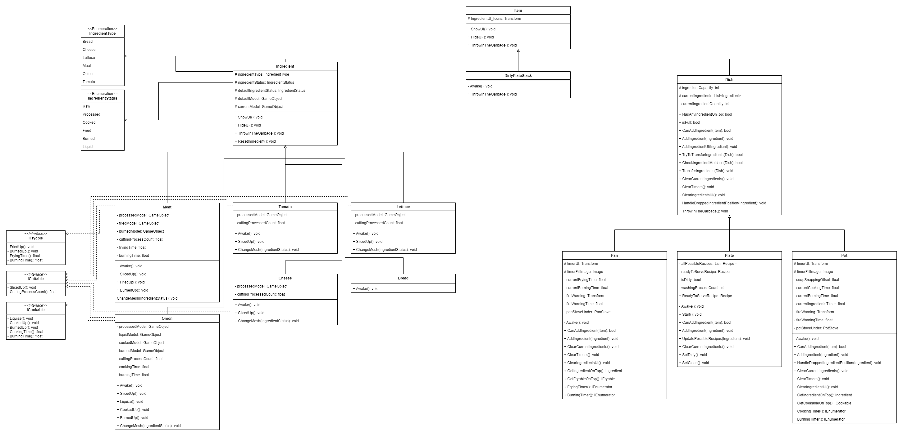

# Cooked but Still Raw
Cooked but Still Raw is a clone project of "Overcooked" that we developed as 2 college friends who are interested in game programming.

The aim of this project is to develop ourselves, and get familiar with common design patterns and object-oriented programming, especially in game development.

In this project, we also aimed to achieve to provide a guideline for those who are interested in game development about how we used the common structures in computer science in Unity Game Engine.

[Gameplay video on youtube](https://www.youtube.com/watch?v=jpWdf1HOItw)

[To play the game on itch.io](https://nikelajj.itch.io/cooked-but-still-raw)

## Table of Contents

> 1. [About the Project](#intro)
> 2. [Gameplay & Mechanics](#gameplay)
> 3. [In Game Pictures](#pictures)  
> 4. [In Game Video](#video) 
> 5. [Scripts & Definitions](#scripts)
> 6. [Hierarchy Diagrams](#diagrams)
> 7. [Credits](#credits)
> 8. [Installation Guide](#installation)
> 9. [Reach Us](#reach)

## 1. About the Project
This project is a replica project of overcooked we developed as 2 college friends in order to get familliar with the usages of common design patterns and object-oriented programming.
 
We implemented the project by sticking to 4 pillars of object-oriented programming that are;
<ul>

    Abstraction
    Encapsulation
    Inheritance
    Polymorphism

</ul>
In addition to the general software engineering patterns we also used various design patterns that are especially useful for game programming such as;
 
<ul>

    Singleton Design Pattern
    State Pattern
    Flyweight Pattern
    Object Pooling Pattern
    Command Pattern
    Type-Object Pattern
    Subclass Sandbox Pattern
    Composite Design Pattern

</ul>
We studied the Patterns from Bob Nystrom's "<a href="http://gameprogrammingpatterns.com/contents.html">Game Programming Patterns</a>" and implemented them in a way that we see fit.

## 2. Gameplay & Mechanics
In the game, there is a character that we posses. And several furniture that we are able to interact. Goal of the game is correctly serving as much orders as we can before the time runs out.
In order to serve the desired food we have to interact with the furnitures around us.

* Use W-A-S-D to move around the kitchen.
* Use E to pick up or drop items from/to furniture.
* Use the spacebar to interact with the furniture.

## 3. In Game Pictures

## 4. In Game Video
For the youtube video of full gameplay click on the gif below.

## 5. Scripts & Definitions
* Audio Manager
    > Controls audio within the game.
* Bread
    > Ingredient to prepare recipes.
* Cheese
    > Ingredient to prepare recipes.
* Cutting Board
    > Furniture to slice ingredients.
* Default Counter
    > Furniture with no interactive action.
* Delivery Counter
    > Furniture to serve meals.
* Dirty Plate Counter
    > Furniture to return plates from orders.
* Dirty Plate Stack
    > Stack to overlap dirty plates.
* Dish
    > Item to contain ingredients inside.
* Furniture
    > Objects we can interact with.
* Game Controller
    > Controls the state of the game.
* Game Input Controller
    > Binds inputs to the actions.
* Highlight
    > Shows visual feedback on the closest furniture.
* How To Play UI
    > Responsible for actions in tutorial UI.
* ICookable
    > Interface for cookable ingredients.
* ICuttable
    > Interface for cuttable ingredients.
* IFryable
    > Interface for fryable ingredients.
* Ingredient
    > Items to prepare meals.
* Ingredient Box
    > Furniture to retrieve ingredients.
* Ingredient Status
    > Enum to store status of the ingredient.
* Ingredient Type
    > Enum to store the type of ingredient.
* Interact Controller
    > Controls which furniture to interact.
* Item
    > Objects that we can pick up and drop off.
* Lettuce
    > Ingredient to prepare recipes.
* Look At Camera
    > Responsible for UI elements rotation.
* Main Menu UI
    > Responsible for actions in Main Menu UI.
* Meat
    > Ingredient to prepare recipes.
* Menu Character Movement
    > Moves character on Main Menu screen.
* Menu Manager
    > Manages the actions in Menu.
* Onion
    > Ingredient to prepare recipes.
* Order Manager
    > Responsible for managing orders.
* Order UI
    > Displays the order information on UI.
* Pan
    > Dish to contain fryable ingredients.
* Pan Stove
    > Furniture to fry ingredients.
* Plate
    > Dish to serve meals.
* Player Controller
    > Responsible for player actions.
* Pooling Manager
    > Manages object pooling within the game.
* Pot
    > Dish to contain cookable ingredients.
* Pot Stove
    > Furniture to fry ingredients.
* Recipe
    > Container to store ingredient combinations.
* Recipe Manager
    > Responsible for available recipes.
* Settings UI
    > Responsible for actions in settings UI.
* Singleton
    > Responsible for static references.
* Sink
    > Furniture to cleanse dirty plates.
* Sprite Provider
    > Responsible for UI sprites.
* Tomato
    > Ingredient to prepare recipes.
* Trash Can
    > Furniture for undesired ingredients.
* UI Manager
    > Manages UI elements within the game.

## 6. Hierarchy Diagrams

## 7. Credits
* Assets from <a href="https://www.kenney.nl/">Kenney</a>
* Musics from <a href="https://tallbeard.itch.io/music-loop-bundle">Tallbeard Studios</a>

## 8. Installation Guide
* We encourage you to get the same version of Unity that we used, to prevent any version conversion conflicts, which is version <a href="https://unity.com/releases/editor/whats-new/2020.3.17">2020.3.17</a>.

## 9. Reach Us
* Feel free to reach us for any kind of questions, recommendations or criticism.

> Mehmet Selim Can 
Linkedin: <a href="https://www.linkedin.com/in/mehmet-selim-can/">Mehmet Selim Can</a> 
Mail: <a href="mailto:mehmetselimcn@hotmail.com">mehmetselimcn@hotmail.com</a>

 

> Mehmet Safa Katırcıoğlu 
Linkedin: <a href="https://www.linkedin.com/in/mehmet-safa-katircioglu/">Mehmet Safa Katırcıoğlu</a> 
Mail: <a href="mailto:safaktrcgl@gmail.com">safaktrcgl@gmail.com</a>
